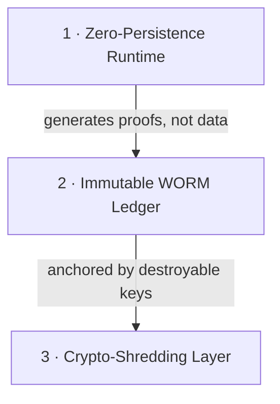

# ATI — Auditable Trust Infrastructure

### The category for proving what a regulated AI system did, without keeping the data that proves it.

[](category/)
[](INDEX.md)
[](category/02_trust-by-physics-pillars.md)
[](compliance/COMPLIANCE_MATRIX.md)
[](LICENSE)

---

> **"Trust should not be a promise. It should be a transaction."**

**Auditable Trust Infrastructure (ATI)** is an architectural category — a Layer-0 standard for how AI, data, and trust interact inside regulated institutions. It exists to resolve a conflict that policy and process cannot: the law requires you to **retain** the evidence of a decision for years, and simultaneously requires you to **erase** the personal data behind it on request.

ATI answers the question that breaks conventional compliance:

> **How do you prove you made the right decision if you deleted the data?**

This repository is the **public canon** of the category: the narrative that defines it, the frameworks that implement it, the products built on it, and the cryptographic contracts that make its claims verifiable rather than rhetorical.

👉 **New here? Start with [the category narrative](category/) or jump to the [Master Index](INDEX.md).**

---

## Why a category, not a product

Most "compliance AI" is probabilistic scoring with a confidence number stapled on. ATI is a different posture: **trust by physics, not trust by policy.** You do not promise an auditor you behaved; you hand them a cryptographic proof that you could not have behaved otherwise.

| | Conventional approach | The ATI posture |
| :--- | :--- | :--- |
| **Logic** | Probabilistic ("maybe fraud") | Deterministic ("policy violated at line 42") |
| **Data** | Leaky (needs PII at rest) | Capsulated (PII-free state objects) |
| **Audit** | "Explainable" (post-hoc rationalization) | **Verifiable** (cryptographic proof of causality) |
| **Erasure** | Conflicts with retention | **Crypto-shredding** (retain ciphertext, destroy the key) |
| **Trust** | "We promise not to look" | **"We cannot look"** |

---

## The three pillars of Trust by Physics



1. **Zero-Persistence** — sensitive data lives in volatile memory only for the milliseconds a decision takes. No disk write. When the transaction closes, the data evaporates.
2. **Immutable WORM Ledger** — the system stores *proofs*, not payloads: the cryptographic hash of every decision, logic path, and outcome, write-once and tamper-evident.
3. **Crypto-Shredding** — "forgetting" a subject means destroying the encryption key for their records. The ciphertext stays (retention satisfied); without the key it is mathematical entropy (erasure satisfied).

Full treatment in **[category/02 — Trust by Physics](category/02_trust-by-physics-pillars.md)**.

---

## How this repository is organized

```text
ATI/
├── category/                  # THE CREATION OF THE CATEGORY — start here
│   ├── 01 · The Regulatory Paradox
│   ├── 02 · Trust by Physics (the three pillars)
│   ├── 03 · Cognitive Auditability (taming generative AI)
│   └── 04 · Strategic Impact
│
├── modules/                   # THE BUILDING BLOCKS
│   ├── frameworks/            #   the open specifications
│   │   ├── f2f-raat/          #     From Fact to Feedback — deterministic execution engine
│   │   ├── spezzatura/        #     the T² reputation model (the math)
│   │   ├── state-capsule/     #     the PII-free boundary object (the memory)
│   │   ├── burn-engine/       #     deterministic authorization (the actuator)
│   │   ├── veritas/           #     immutable audit trail & proofs (the truth)
│   │   └── threat-model/      #     adversarial analysis & mitigations
│   └── products/              #   what gets built on the frameworks
│       └── rex-guard/         #     cryptographic governance layer for generative AI
│
├── reference-architecture/    # public, sanitized reference SAD for regulated GenAI
├── whitepaper/                # the deep-dive theory
├── governance/                # policy signing, break-glass control
├── compliance/                # regulatory mapping + test vectors
├── interface-contracts/       # OpenAPI + canonical Fact schemas
├── cookbooks/                 # real-world scenario walkthroughs
└── GLOSSARY.md                # canonical vocabulary of the category
```

---

## Positioning & honesty

ATI is described here as *architected for* and *aligned with* the regulations it addresses (LGPD, GDPR, BCB / CMN cybersecurity norms, EU AI Act). Certification and production status are tracked **per deployment**, not asserted blanket-wide. The frameworks in this repo are normative specifications; the metrics that appear in the narrative come from controlled validation and are flagged as illustrative where they do.

This is deliberate. A category whose central claim is *verifiable trust* cannot afford an unverifiable sentence in its own README.

---

## License

Authored by **FoundLab** — *Auditable Trust Infrastructure*.
Licensed under **Creative Commons Attribution-NonCommercial-NoDerivatives 4.0 International**. See [LICENSE](LICENSE).

> This repository publishes category-level documentation and reference architecture materials. It is not an open-source software implementation and does not grant rights to use FoundLab private systems, trademarks, customer deployments, or NDA materials.

> *don't trust, verify.*
