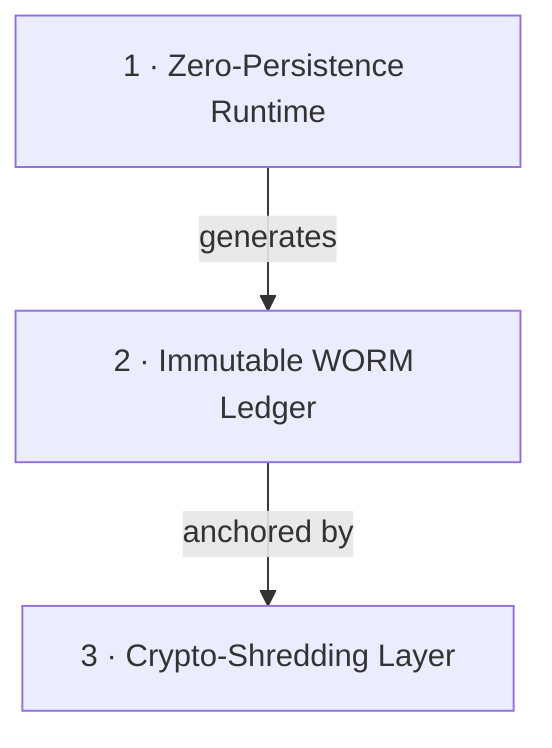

# The Category: Auditable Trust Infrastructure

> **"Solving the conflict between Privacy and Proof."**

This folder is the conceptual core of the repository — the narrative that *creates the category* before any code defines it. Start with **[the category thesis](./00_category-thesis.md)** — the founding document — then read the four-move argument: the problem, the architecture that dissolves it, the way it tames generative AI, and the strategic consequence.

---

## The problem ATI exists to solve

Regulated institutions live inside a contradiction:

- The law requires them to **know their customer** and **keep the evidence** — immutably, for 5–10 years (BCB / CMN norms, SOX).
- The same legal environment requires them to **forget** personal data on request — the right to erasure (LGPD, GDPR).

Storing the data risks a privacy violation. Deleting it risks an evidence-destruction violation. This is the **Retention Paradox**, and it cannot be solved by better policy — only by a different architecture.

ATI replaces *policy-based* trust ("we promise not to look") with *physics-based* trust ("we cannot look").

---

## The three pillars

- **Zero-Persistence** — data exists only in volatile memory, only for the milliseconds a decision needs. → see the Burn Engine framework.
- **Immutable WORM Ledger** — store proofs, not payloads. → see the Veritas framework.
- **Crypto-Shredding** — erase by destroying the key, not the record. → KMS layer.

---

## Cognitive Auditability

Traditional AI explains itself with *"confidence: 94%"*. ATI demands **causal rationale**: the model must externalize a human-readable reason, that reason is hashed and signed onto the WORM ledger, and the decision runs at near-zero temperature so it is replicable. The result is a mathematical proof of *what the system was reasoning* at the moment of decision — without retaining the raw data it reasoned over.

This is the **Rationale Extraction (REX)** pattern, and it is the seam where the category meets the [REX product family](../modules/products/README.md).

---

## The narrative, in order

0. **[The Category Thesis](./00_category-thesis.md)** — the founding document: the failure of policy-based trust, why GRC/XAI/SIEM/observability do not solve it, the definition, and the invariants as the membership test.
1. **[The Regulatory Paradox](./01_the-regulatory-paradox.md)** — why institutions are trapped between retention and erasure.
   *(Legal specifics in the [Compliance Matrix](../compliance/COMPLIANCE_MATRIX.md).)*
2. **[Trust by Physics](./02_trust-by-physics-pillars.md)** — how physics is used to satisfy law.
3. **[Cognitive Auditability](./03_cognitive-auditability.md)** — taming probabilistic AI with deterministic proof.
4. **[Strategic Impact](./04_strategic-impact.md)** — how the architecture becomes a competitive advantage.

The non-negotiable rules that define a compliant deployment: **[The Category Invariants](./invariants.md)**.

---

[⬅️ Back to the ATI Index](../README.md) · [Explore the Modules ➡️](../modules/README.md)
