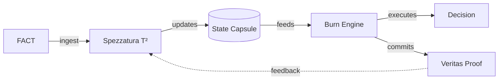

# Frameworks

The open specifications that make up **Auditable Trust Infrastructure**. Each framework is normative: changing a line in an `invariants` or schema file is a versioned event, not a cosmetic edit.

They compose into a single closed loop:

---

## The six frameworks

### Core logic
- **[f2f-raat/](f2f-raat/)** — *From Fact to Feedback*. The execution contract, decision model, invariants, economic binding, and policy governance. **The Law.**
- **[spezzatura/](spezzatura/)** — the T² reputation model: vector calculation, sigmoid P(x) decay, the multiplicative scoring law. **The Brain.**
- **[state-capsule/](state-capsule/)** — the PII-free state object passed between subsystems: schema, constraints, validation examples. **The Memory.**
- **[burn-engine/](burn-engine/)** — the deterministic authorization engine: effect set, decision computation, test vectors. **The Hammer.**

### Assurance
- **[veritas/](veritas/)** — proof specification, audit rules, commitment examples. **The Truth.**
- **[threat-model/](threat-model/)** — adversarial vectors, the red-team matrix, and mitigations. **The Defenses.**

---

## Reading order

If you are implementing, read **state-capsule → spezzatura → burn-engine → veritas**, then **f2f-raat** for the contract that binds them. If you are auditing, start at **veritas** and **threat-model**.

---

[⬅️ Back to Modules](../README.md) · [ATI Index](../../README.md)
