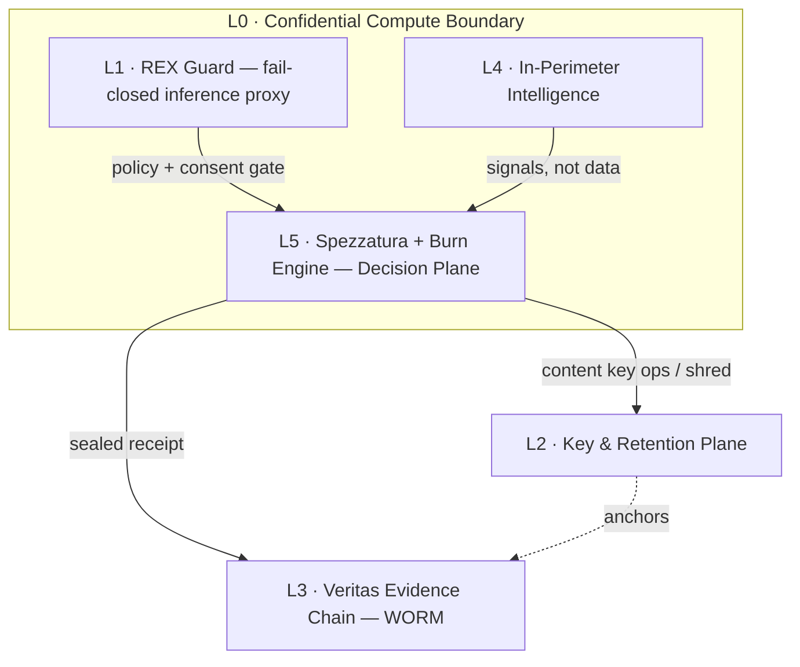

# ATI Reference Stack
## L0 + Five Execution Layers

> The minimum technical composition required to convert regulated AI inference into **deterministic, auditable, privacy-preserving execution**.

The ATI Reference Stack is the bridge between the **category** (why ATI exists) and an **implementation** (e.g. REX Guard). It is deliberately *not* a framework and *not* a product:

- A **framework** ([modules/frameworks/](../modules/frameworks/)) is one normative primitive — the Burn Engine, Veritas, Spezzatura, the State Capsule.
- A **product** ([modules/products/](../modules/products/)) is a deployable — REX Guard.
- The **Reference Stack** is the *composition*: the layered arrangement of platform boundary, runtime, key plane, evidence plane, intelligence plane, and decision plane that any compliant ATI deployment must instantiate.

It is **L0 + five execution layers** (six numbered planes, 0–5). "L0" is the trust boundary the other five execute inside.

---

## The stack

| Layer | Plane | Execution role | Classification |
| ---: | :--- | :--- | :--- |
| **L0** | Confidential Compute Boundary | Trusted execution boundary using Confidential Computing patterns — **hardware-backed and cryptographically attestable under the selected deployment profile**, including AMD SEV-SNP / Intel TDX where available and required by that profile. | Platform Boundary |
| **L1** | Inference Proxy (**REX Guard**) | Fail-closed inference interception *before* model access: policy evaluation, consent validation, input/output controls, and sealed-receipt emission. **Target overhead below 50 ms P99 under validated deployment conditions.** | Product Runtime |
| **L2** | Key & Retention Plane | Envelope encryption, content-key lifecycle, legal-hold state, and key-destruction workflow. Implements **crypto-shredding as a technical inaccessibility control** — not a claim of unconditional legal erasure. | Key / Retention Plane |
| **L3** | Evidence Plane (**Veritas Evidence Chain**) | SHA-256 hash-chaining and DecisionID sequencing, time-ordered via a TrueTime-class sequencer, projected into a write-once (WORM) audit store. The sequencer orders; the WORM store projects — it never sequences. | Evidence Plane |
| **L4** | In-Perimeter Intelligence | Contextual inference and anomaly detection **designed to prevent raw PII from leaving the protected execution perimeter**. Operates inside L0; emits signals, not data. | Intelligence Plane |
| **L5** | Decision Plane (**Spezzatura + Burn Engine**) | Multiplicative reputational scoring and deterministic policy evaluation, producing a binding regulatory decision **only after sanctions / prohibited-party checks have cleared**. Prohibited-party gates execute *before* any scoring. | Decision Plane |

---

## How the layers compose

Read top to bottom: every layer above L2/L3 runs **inside** the L0 boundary. The Key Plane (L2) and Evidence Plane (L3) sit outside the volatile runtime so that *proofs and ciphertext survive* while *plaintext evaporates*. This is the physical expression of the three pillars — Zero-Persistence, the immutable WORM ledger, and crypto-shredding — described in **[category/02 — Trust by Physics](../category/02_trust-by-physics-pillars.md)**.

---

## How it maps to the rest of the canon

| Stack layer | Defined by |
| :--- | :--- |
| L1 — Inference Proxy | Product: **[REX Guard](../modules/products/rex-guard/)** |
| L3 — Evidence Plane | Framework: **[Veritas](../modules/frameworks/veritas/)** |
| L5 — Scoring | Framework: **[Spezzatura](../modules/frameworks/spezzatura/)** |
| L5 — Decision | Framework: **[Burn Engine](../modules/frameworks/burn-engine/)** |
| Decision state passed L1↔L5 | Framework: **[State Capsule](../modules/frameworks/state-capsule/)** |
| Execution contract binding all layers | Framework: **[F2F-RAAT](../modules/frameworks/f2f-raat/)** |
| Adversarial assurance over the stack | Framework: **[Threat Model](../modules/frameworks/threat-model/)** |

L0 (Confidential Compute Boundary), L2 (Key & Retention Plane) and L4 (In-Perimeter Intelligence) are **platform/operational planes** — they are realized by cloud-native confidential computing, KMS, and in-perimeter inference rather than by a single normative spec in this repository.

> **One numbering, two granularities.** This six-plane composition (**L0–L5**) is the canonical layer numbering. A finer **component inventory** — used for stakeholder accountability (RACI / SLAM) in deployment-specific annexes — decomposes some planes further (e.g. separating the evidence projection store from the proof chain, or key custody from the shredding workflow). That inventory is an *accountability view* that **maps onto these planes**; it does not replace or renumber them. Any deployment artifact that introduces its own layer count must cross-reference back to L0–L5 so the two never contradict.

The category-level rules every layer must honor are the **[Category Invariants](../category/invariants.md)**.

---

## Packaging & deployment

The stack is composed **per deployment** against an assurance profile, not shipped as a fixed monolith. Layers L0/L2/L4 are platform-dependent; L1/L3/L5 are the ATI-specific planes. Because the composition is deployment-scoped and consumption-metered, it is well suited to delivery as a **cloud-marketplace private offer**, where each layer's assurance profile and certification status is fixed for that specific deployment.

> **Certification.** Production and certification status are tracked **per deployment**. This document describes a reference composition; it does not assert blanket production readiness for any layer.

---

## Required vs conditional (for REX Guard deployments)

| Layer | Required? |
| :--- | :--- |
| L1 — Inference Proxy (REX Guard) | **Required** |
| L3 — Evidence Plane | **Required** |
| L5 — Decision Plane | **Required** |
| L0 — Confidential Compute Boundary | **Required for regulated deployments** |
| L2 — Key & Retention Plane | **Required when retention + erasure obligations both apply** |
| L4 — In-Perimeter Intelligence | **Required when a stateful reputational / PII-free risk context exists** |

This prevents two failure modes: treating reputational scoring as mandatory for every deployment, and omitting the Key & Retention Plane when both retention and erasure mandates are live.

---

[⬅️ Back to Reference Architecture](./README.md) · [ATI Index](../README.md) · [Category narrative](../category/README.md)
